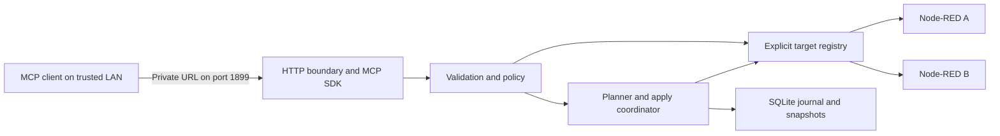

# Node-RED MCP Hub — implementation architecture

Version: 2.0 | Reviewed: 2026-09-05 | Status: ready for phased implementation

This replaces design guide 1.0. It specifies intended behavior, not an existing implementation. The current task is architecture and developer handoff. See [developer instructions](DEVELOPER_GUIDE.md) and [review findings](ARCHITECTURE_REVIEW.md).

## 1. Product and scope

| Item | Decision |
| --- | --- |
| Display name | Node-RED MCP Hub |
| Slug and app directory | `node_red_mcp_hub` |
| Repository | `home-assistant-node-red-mcp-hub` |
| Container | `ghcr.io/<username>/node-red-mcp-hub` |
| Description | Secure multi-server MCP gateway for managing Node-RED flows |
| Production platform | Home Assistant OS, amd64 and aarch64 |
| Development | Docker with two disposable Node-RED targets |
| Configuration UI | Home Assistant app options; no custom dashboard in v1 |
| Endpoint | `http://192.168.3.57:1899/private_<secret>` |
| Authentication | Private URL only, for trusted LAN clients; no bearer header |

The user explicitly selected URL-only access. Possession of the full URL authorizes the configured operations. All clients share one principal; individual client revocation and attribution are unavailable in v1. Header authentication is a possible future enhancement, not a launch requirement. Use a fresh secret with the requested URL shape, not the example credential from conversation. The HA IP is a deployment example, not a hard-coded bind address or Node-RED target.

Home Assistant Supervised is not a supported production target following its support transition. HA Container cannot install Supervisor apps; a standalone gateway container remains useful for development. [HA installation support announcement](https://www.home-assistant.io/blog/2025/05/22/deprecating-core-and-supervised-installation-methods-and-32-bit-systems/)

Delivery phases:

- Alpha: private-path MCP transport, isolated targets, reads, resources, prompts and HA packaging.
- Beta: prepared flow edits, revision checks, durable snapshots/journal, apply and scoped rollback.
- v1: tested beta functionality, backup/restore, documentation and multi-architecture publishing.
- Extensions: context access, WebSocket observation, semantic search and module management, separately gated.

Upstream feature parity is a roadmap objective, not a reason to ship unverified APIs. The reference project advertises flows, context, modules, diagnostics, semantic search, resources and prompts. This design owns its transport, security and mutation semantics. [Upstream reference](https://github.com/ziv-daniel/node-red-mcp)

## 2. Architecture



Use one TypeScript process and listener. Use the official MCP TypeScript SDK, a small HTTP framework, strict runtime schemas, an HTTP client with controllable DNS/connect behavior, and SQLite. Select and pin exact supported versions in M0. Do not run an upstream process per target. Port reviewed helpers only after checking their license and recording provenance; a mandatory wholesale fork is unnecessary.

Boundaries: HTTP authentication/limits → MCP schemas → policy → domain services → Node-RED adapter → storage. Only adapters perform target network I/O; only the apply coordinator can invoke deployment. Tools cannot accept arbitrary URLs, HTTP paths, shell commands or target credentials. The selected target is an immutable call-local value, never a global/session variable.

Run one worker with an exclusive process lock on the database. Use per-target apply mutexes and transactional durable state. No replicas or clustering without a new coordination design. Configuration changes require restart in v1.

## 3. Endpoint, credential and protocol

### Private URL

- Listen on container `0.0.0.0:1899`; HA Network options control host mapping. No independent listen_port option.
- Serve MCP directly at exactly `/private_<secret>`. No `/mcp` alias, redirect, trailing slash, directory listing or legacy SSE endpoint.
- `GET /healthz` is the sole non-secret route; return only `{"status":"ok"}` after initialization, otherwise 503. Target outages do not affect it.
- Wrong/absent secrets and unknown paths return the same small 404. Reject queries, encoded separators, duplicate slashes, dot segments and trailing-slash variants rather than normalizing them into the private route.
- Bound URL length, then compare fixed-length hashes in constant time. Never echo submitted paths.
- Require allowed Host authorities, including port. Permit absent Origin for machine clients; reject present origins outside the exact allowlist with 403. CORS is off. Add the actual watchdog Host authority during HA acceptance testing.
- Disable raw URL access logs and traces. Log route label `mcp`, not path, query, Referer or raw headers; apply the same policy to reverse proxies.

`mcp_path_secret` is a required password-style HA option containing 32 random bytes encoded as 64 hexadecimal characters. The app prefixes it with `/private_`. Generate locally using `node -e "console.log(require('node:crypto').randomBytes(32).toString('hex'))"`; keep the result out of source and issue reports. Empty/placeholder/invalid secrets prevent startup with field-name-only errors. The app must not print a usable private endpoint.

Rotation: replace the option, restart, update client URLs. The old URL stops working and prepared proposals become invalid. HA backup restoration can restore an old URL secret; rotate after recovery. Password UI fields still exist in options/backups and are not encrypted merely by using that field type.

HTTP matches the requested trusted LAN setup but does not encrypt the URL or traffic. Restrict port 1899 to trusted clients with network firewall rules; Docker publication alone is not a trusted-subnet restriction. No router forwarding. Use verified TLS or an encrypted private tunnel outside that LAN. URL-only access remains the chosen model.

Manually configured URL clients are the v1 compatibility target. No OAuth discovery or OAuth-only client compatibility is claimed. [MCP authorization model](https://modelcontextprotocol.io/specification/2025-11-25/basic/authorization)

### Streamable HTTP

Use SDK stateless mode and JSON responses in v1. Application proposals are durable independently of transport sessions. Target baseline protocol is `2025-11-25`; record actual versions supported by the pinned SDK in COMPATIBILITY.md.

Implement initialization, initialized notifications, ping, tools, resource templates and prompts. Accepted notifications return 202 with no body. Authenticated GET returns 405 because no standalone SSE stream is offered; DELETE returns 405 because sessions are not used. Do not issue Mcp-Session-Id. Verify negotiation, protocol headers, unsupported batch rejection and content types through SDK tests. Advertise no sampling, roots, subscriptions or elicitation capabilities. [MCP transport specification](https://modelcontextprotocol.io/specification/2025-11-25/basic/transports)

A disconnected client does not cancel a dispatched write. MCP annotations guide clients but do not enforce policy. Tool failures use `isError: true` with structured `{code, message, server_id?, proposal_id?, retryable}`. Protocol errors use SDK JSON-RPC handling. HTTP errors cover routing/Origin, 413, 415, 429 and methods. Never expose upstream bodies or stacks.

Domain codes: UNKNOWN_SERVER, READ_ONLY, CAPABILITY_UNAVAILABLE, TARGET_UNAVAILABLE, TARGET_AUTH_FAILED, VALIDATION_FAILED, REVISION_CONFLICT, PROPOSAL_EXPIRED, PROPOSAL_INVALIDATED, APPLY_IN_PROGRESS, OUTCOME_UNKNOWN, STORAGE_UNAVAILABLE, RESULT_TOO_LARGE, BUSY.

## 4. HA package and configuration

Root repository.yaml describes the repository; each app has its own directory. Planned files in node_red_mcp_hub/: config.yaml, Dockerfile, apparmor.txt, README.md, DOCS.md, CHANGELOG.md, translations/en.yaml and gateway source. Follow the current app template for init and image labels. [Repository format](https://developers.home-assistant.io/docs/apps/repository/)

Manifest decisions: `1899/tcp: 1899`, startup application, boot auto, init false for s6, stage experimental, AppArmor enabled, cold backup, timeout 30 seconds and /ssl read-only. No HA/Supervisor/auth/Docker API, host networking, hardware or privileged access. Watchdog: `[PROTO:tls_enabled]://[HOST]:[PORT:1899]/healthz`; verify HTTP, HTTPS and Host behavior on HA. Prebuilt image uses the generic GHCR name and version selects its tag. [HA configuration](https://developers.home-assistant.io/docs/apps/configuration/)

Implement this complete v1 option contract in HA and strict runtime schemas. Reject unknown keys and inconsistent auth modes. Keep target records flat to respect HA schema depth.

| Option | Default / constraints |
| --- | --- |
| mcp_path_secret | Empty; password UI; startup requires 64 hex characters |
| allowed_hosts | Required list of literal host:port authorities; no wildcard |
| allowed_origins | Empty list; exact http(s) origins |
| tls_enabled | false |
| certfile / keyfile | fullchain.pem / privkey.pem; basenames under /ssl |
| global_read_only | true |
| proposal_ttl_seconds | 300; integer 30–1800 |
| snapshot_retention | 20 per target; integer 1–100 |
| data_budget_mb | 256; integer 64–2048 |
| request_timeout_seconds | 15; integer 2–30 per outbound request |
| max_request_body_kb | 1024; integer 64–10240 |
| max_target_response_kb | 10240; integer 64–20480 after decompression |
| log_level | info; debug/info/warn/error; always redacted |
| servers | Required list of 1–20 target records |
| servers[].id | Required; unique; `^[a-z][a-z0-9_-]{0,31}$` |
| servers[].label | Required; 1–80 characters |
| servers[].url | Required http(s) Admin API base, optional admin-root path |
| servers[].allowed_addresses | Required comma-separated exact IPs/CIDRs; parsed at runtime |
| servers[].auth_mode | Required: credentials / bearer / basic_proxy / none |
| servers[].username / password / token | Empty defaults; password/token use password UI |
| servers[].ca_file | Empty uses system trust; otherwise /ssl basename |
| servers[].read_only | true |
| servers[].allowed_node_types | Empty; comma-separated exact installed type IDs; no wildcard |

No flags for unimplemented extensions. Certificate verification is always enabled, including with a custom CA. No tls_verify:false option. Conditional fields are validated at startup.

Initial fixed limits: 20 concurrent calls overall; 4 outbound reads per target; one apply per target; 10 queued applies per target; 60 requests/minute/source IP with burst 20; 10,000 graph nodes; list pages default 100/max 500; 1 MiB MCP results; 100 pending proposals globally; overall call deadline 45 seconds including queueing. Return BUSY on excess work. Bound rate-limiter keys and expire idle entries. These are design budgets, not measured performance claims. Oversized results use pagination or RESULT_TOO_LARGE, never silently truncated JSON. Proxy headers are ignored in v1; rate limiting uses socket peers.

Partial options illustration; defaults are defined above and placeholders intentionally fail startup:

```yaml
mcp_path_secret: REPLACE_WITH_64_HEX_CHARACTERS
allowed_hosts:
  - 192.168.3.57:1899
allowed_origins: []
global_read_only: true
servers:
  - id: ha_main
    label: Home Assistant Node-RED
    url: http://NODE_RED_DIRECT_HOST:1880
    allowed_addresses: REPLACE_WITH_TARGET_IP_OR_NARROW_CIDR
    auth_mode: credentials
    username: mcp_reader
    password: REPLACE_ME
    token: ""
    ca_file: ""
    read_only: true
    allowed_node_types: ""
```

Add the actual watchdog Host authority during installation. Client setup supplies only the private URL; client JSON formats are tested individually, not presented as universal syntax.

## 5. Target adapters and network enforcement

Each target owns its dispatcher, auth cache/refresh mutex, health, capabilities and write mutex. Persistent objects use server ID plus an internal target-generation identifier. Changing connection configuration/auth or reusing an ID for a different server creates a new generation; old proposals are invalid and old snapshots cannot automatically restore onto the new target.

Native adminAuth uses POST /auth/token with documented password-grant fields, including client_id=node-red-admin, grant_type=password and suitable scope. Cache to expiry in memory and serialize refresh. Static bearer requires a compatible target; basic_proxy is an explicitly verified HTTP Basic proxy, not native adminAuth. No-auth requires explicit selection. A 401 may cause one refresh/read retry, but never automatic deployment replay. [Node-RED authentication](https://nodered.org/docs/api/admin/oauth), [Token exchange](https://nodered.org/docs/api/admin/methods/post/auth/token/)

Do not confuse HA Node-RED ingress or http_node credentials with the Admin API. Probe the actual direct/internal endpoint for JSON /flows. Prefer a verified internal app alias when available; publish Node-RED's direct port only if needed for the installed package. Do not assume a universal hostname or Basic login. Record package/auth behavior in compatibility tests. [HA Node-RED documentation](https://github.com/hassio-addons/app-node-red/blob/master/node-red/DOCS.md)

Network rules:

1. Only configured http(s) origin and normalized admin-root path; no userinfo, query or fragment. Encode opaque IDs as single segments. Reject IDs that can alter routing.
2. Destinations must satisfy both target-specific address allowlist and RFC1918 IPv4/IPv6 ULA rules. Reject public, loopback, link-local/metadata, unspecified and multicast addresses, including mapped-address bypasses.
3. Resolve all A/AAAA records at connection time, reject mixed allowed/disallowed results and connect through the validated address. Do not validate DNS and then allow a second uncontrolled lookup. Preserve original Host, SNI and certificate validation.
4. Disable all redirects and implicit environment proxies. Reuse the same guarded connector for auth/probes and future WebSockets; reconnect revalidates DNS.
5. Restrict methods/paths in adapters. No tool-provided destination, callback or registry. No runtime public downloads in v1.
6. CA/cert/key paths must resolve beneath /ssl; reject traversal and escaping symlinks. No certificate-verification bypass.

Private subnets are not themselves service authorization. Fixed target configuration, credentials and method allowlists provide further constraints. The hub cannot sandbox outbound requests made by Node-RED nodes after deployment.

## 6. Tools and resources

Every target-specific call requires server_id, including status, validation and snapshots. No default target or cross-target apply. list_servers returns ID, label, policy, health and capabilities, never connection URL or credentials.

| Tool | Inputs beyond server_id | Phase / behavior |
| --- | --- | --- |
| list_servers | No server_id; cursor?, limit? | Alpha; configured summaries |
| get_server_health | None | Alpha; sanitized health/capabilities |
| get_flows | cursor?, limit?, include_details=false | Alpha; revision-bound page |
| get_flow | flow_id | Alpha; view from v2 graph |
| search_flows | query, flow_id?, type?, cursor?, limit? | Alpha; bounded literal search |
| validate_flow | flow_data OR flow_id | Alpha; no execution/write |
| get_installed_modules | cursor?, limit? | Alpha; GET /nodes |
| get_settings | None | Alpha; allowlisted fields |
| get_runtime_info | None | Alpha; sanitized diagnostics if supported |
| get_flow_state | None | Alpha; runtime-wide /flows/state if supported |
| prepare_change | operation, operation-specific payload | Beta; no target write |
| apply_change | proposal_id, confirmation_token | Beta; stored proposal only |
| get_change_status | proposal_id | Beta; durable outcome |
| list_snapshots | cursor?, limit? | Beta; metadata only |
| prepare_rollback | snapshot_id, flow_id | Beta; scoped topology proposal |

prepare_change operation is a discriminated union: create_flow(flow_data), update_flow(flow_id, flow_data), enable_flow(flow_id), disable_flow(flow_id), delete_flow(flow_id). flow_data is `{id?, label, disabled, nodes, configs}` with bounded strict shape. The planner converts it into the flat runtime graph. Creation allocates IDs at prepare and returns any mapping; new tabs default disabled. Updates retain IDs unless explicitly adding/deleting. Enable/disable modifies the tab's disabled field, not runtime-wide start/stop.

Only apply_change mutates. No convenience write aliases in v1, no force flag, replacement JSON or deploy override on apply. Unknown fields fail validation. Global read-only hides prepare/apply/rollback and rejects calls by name; target read-only is checked at both prepare and apply. Validation and status/snapshot metadata reads remain available.

Results include server_id/revision where applicable. Cursors bind to target generation, query and revision; a changed revision requires restarting pagination. Resource reads share tool policies/projections/limits. URIs: nodered://servers, nodered://<server_id>/flows, /subflows, /nodes, /flow/<flow_id>, /system/runtime; parse server_id as a validated URI authority. Prompts debug_flow, explain_automation, audit_security and document_flow require server_id and cannot execute operations. Target comments/code/labels are untrusted data, never instructions or authorization.

## 7. Revision-safe mutation lifecycle

Plan a scoped edit over a complete graph; deploy only with POST /flows API v2 and its revision check. Individual-flow mutation endpoints do not document equivalent preconditions, so preflight reading followed by PUT leaves a race. Explicit deployment type is flows; full/reload are not exposed. The request preserves the complete graph despite the scoped intention. [POST /flows](https://nodered.org/docs/api/admin/methods/post/flows/), [PUT /flow](https://nodered.org/docs/api/admin/methods/put/flow/)

Preparation:

1. Resolve target, policy and capabilities; read fresh v2 graph/revision.
2. Clone the complete private graph and perform only the requested edit. Preserve unrelated entries and unknown fields exactly; never rebuild from redacted MCP output.
3. Validate graph and impact. Reject implicit modification/removal of shared configuration nodes or subflow definitions in v1. Local configs may change only where all dependencies are within scope.
4. Persist the immutable candidate graph, base snapshot/revision/hash, affected IDs, deployment type, risk summary, target generation, policy/config fingerprint, expiry and boot ID.
5. Generate a 32-byte one-use token, store its hash and return token, proposal ID, expiry, redacted diff, snapshot ID and restart/effect summary. Do not hold a mutex while waiting for the caller.

Confirmation binds payload and deliberate application; it is not enforced human approval. The same URL principal can call prepare and apply. A separate trusted approval UI/identity would be needed to prove human consent and is outside v1.

Apply:

1. Acquire the target's bounded mutex. Transactionally verify generation, token, boot ID, unexpired PREPARED state and policy fingerprint. Recheck writable policy/capabilities and node effects.
2. Read fresh v2 state. Both original revision and base-graph hash must match; otherwise mark CONFLICT and require new preparation. An earlier UNKNOWN operation blocks further writes to that target.
3. Ensure the immutable snapshot and write-intent audit are durably committed and reserve completion-record space. Consume the token and mark APPLYING atomically before dispatch.
4. Send exactly one conditional deployment with stored graph, original rev and explicit deployment type. Never omit rev or retry automatically. A concurrent external edit after preflight is still checked by Node-RED at deployment.
5. Persist acknowledged revision, then read back with a tested canonicalizer. Mark APPLIED_VERIFIED only on a matching graph. Acknowledged success followed by different state is APPLIED_DIVERGED, since another editor may have changed it.
6. Persist outcome and release mutex in finally. No raw graph or token in audit.

Duplicate apply with the correct token identity returns stored status, never a second deployment; incorrect tokens do not reveal it. JSON-RPC IDs are not idempotency keys.

States: PREPARED → APPLYING → APPLIED_VERIFIED / APPLIED_DIVERGED / REJECTED / UNKNOWN. PREPARED may also become EXPIRED / CONFLICT / INVALIDATED. A documented upstream rejection is REJECTED; timeout, connection loss or unclassified 5xx after dispatch is UNKNOWN. Preserve both acknowledgement and observation in status records.

Startup invalidates PREPARED and turns leftover APPLYING into UNKNOWN; do not retry or roll back. UNKNOWN allows reads but blocks new target writes. A local administrative reconciliation command, unavailable via MCP, records current-state observations and operator acknowledgement before releasing the block. Run it with the gateway service stopped so it can acquire the same exclusive database lock; it may perform guarded reads but cannot deploy. Store an explicit reconciliation record that clears the target write block without rewriting the historical UNKNOWN outcome. Restart the service afterward. Matching topology does not prove exactly-once node execution. Keep historical uncertainty in the journal.

Scoped rollback uses a snapshot's affected tab/local configs merged into the current full graph, checks dependencies and passes through normal preparation with the current base revision. It never silently restores a whole-runtime snapshot over unrelated edits. Reject ambiguous shared references or target-generation mismatches.

## 8. Graph validation and credentials

Validate unique IDs; tab/subflow membership; wires; links; groups; subflow boundaries/ports; config references; installed types; bounded JSON and finite coordinates. Tabs, global config nodes, groups, templates and normal nodes have different z rules. Use exported fixtures with cross-flow links. Unknown custom reference properties cannot be inferred universally: preserve untouched properties and report incomplete validation for edited types without adapters.

Writable node-type allowlist defaults empty. The operator must enable exact types before changes can pass. Assess all added/modified nodes and every node that may restart, including expanded subflows and config dependencies. Unknown types or unbounded impact reject preparation. Function, exec, file, network and HA service-call nodes require explicit inclusion. Even ordinary nodes can affect devices; an allowlist is not a code-execution sandbox. Show affected tabs and restart implications.

Deleting nodes may remove credentials. Snapshots restore topology only, not credentials, messages, physical actions, context or external effects. Reject rollback needing unavailable credentials; use full Node-RED/HA backup or manual credential re-entry. No credential editing through v1 tools.

Keep internal round-trip data separate from external projections. Preserve originals privately; strip known credential structures, configured secrets and sensitive settings externally, with redaction indicators. Never deploy redacted placeholders. Hard-coded secrets in arbitrary code/properties cannot be reliably detected, so detailed flow access is administrator-level data access, not a guarantee of secret-free content. Lists default to metadata, details require an explicit request. No external embeddings in v1.

Release-blocking tests must prove unchanged IDs retain credentials when posting graphs without credential values on every supported Node-RED version. If not, disable writes for that version; never extract/reset credentials as a workaround.

## 9. Storage, recovery and operations

Use /data/hub/hub.sqlite for schema version, generations, proposals, immutable snapshots, operation journal and audit. SQLite uses WAL, foreign keys, busy timeout and durable synchronous commits. Snapshot identifiers are UUIDs and graph blobs carry format versions and SHA-256 hashes; opaque Node-RED revisions never become filenames. Storing snapshots and intents transactionally removes cross-file atomicity gaps.

A small root initializer reads /data/options.json without printing it and writes a 0600 service-owned copy at /run/node-red-mcp-hub/options.json. Do not chmod/chown Supervisor's original. State directories are 0700; DB/WAL/runtime files are 0600. Drop to a dedicated unprivileged user for Node. Stage TLS key material into the protected runtime directory if necessary, respecting /ssl containment. Do not pass secrets on command lines or environment exports.

Cold backup stops the process; graceful shutdown checkpoints/closes SQLite. Restore performs integrity/migration checks, invalidates pending proposals and preserves uncertain outcomes. Make a recoverable DB copy before migration; refuse newer schemas without editing. Version downgrade uses a matching backup, not newer state. Options and stored graphs may contain sensitive information; HA backup protection is part of operations, not a claim of application-level encryption at rest.

Retain newest snapshot_retention snapshots per target plus all pinned by pending/UNKNOWN operations. Apply data_budget_mb to app DB/WAL and migration copies, reserving completion capacity. Expire pending proposals by TTL; retain terminal status/token hashes seven days for deduplication, and audit metadata up to 30 days subject to budget. Prune only safe terminal data. If pinned data exhausts capacity, fail new preparation/apply with STORAGE_UNAVAILABLE while reads continue. A disk failure after dispatch becomes recoverable UNKNOWN, never invented success.

Audit UTC time, correlation ID, principal identifier private-path, server/generation, proposal/snapshot IDs, operation, revision references, policy fingerprint, state, sanitized error and duration. No private path, confirmation token, credentials, raw flow/source or upstream bodies at any level. Local audit is not tamper-proof against host compromise.

Target failures never fail process health. Probe lazily or with bounded background concurrency; distinguish unreachable, auth-failed, incompatible and ready. Read retries: at most two with jitter within deadline; none for validation/auth loops. Per-target circuit breakers isolate outages. SIGTERM stops new calls and drains up to 20 seconds, preserves unresolved state and exits within HA's 30-second timeout.

## 10. Optional capabilities

The public Admin API catalog covers flows, modules, settings, diagnostics and runtime state; it does not establish a general context-mutation contract. Verify adapter behavior instead of assuming upstream advertised tools prove an API exists. [Node-RED methods](https://nodered.org/docs/api/admin/methods/)

| Extension | Prerequisites |
| --- | --- |
| Context reads | Verified endpoint/permissions/version; scope, key, store and serialization limits |
| Context writes/deletes | Explicit supported companion API or verified contract and store concurrency; never temporary Function-node injection |
| WebSocket errors | Tested /comms auth/framing, guarded connector, bounded ring buffer/reconnect; report observation window/drops |
| Semantic search | Opt-in local pinned model, license review, per-target revision index and worker/memory budget; no surprise startup downloads |
| Module search | Fixed registry allowlist and separate outbound policy |
| Module mutation | Exact package/version, dependency/lifecycle-script assessment, backup and outcome tracking; flow snapshots cannot undo packages |

Hide unimplemented tools. Implemented optional tools return CAPABILITY_UNAVAILABLE on unsupported targets without affecting other targets. Context/modules must not be disguised as revision-atomic flow changes.

## 11. Build and release requirements

Follow milestones M0–M5 in DEVELOPER_GUIDE.md. Exact runtime/SDK/base-image/Node-RED versions and GHCR owner are implementation/release inputs to record, not invented compatibility claims.

Use multi-stage locked builds, current HA base/init patterns, dedicated service user and tested AppArmor. Do not ship the earlier broad example profile as evidence of confinement. Exercise DNS, TLS, SQLite, init and shutdown on both architectures with protection enabled. Include license inventory, SBOM, scans, signed immutable images. Pin CI action commits and grant package/OIDC write permissions only to release jobs. Current HA builder uses composable build and manifest actions. [HA security](https://developers.home-assistant.io/docs/apps/security/), [HA builder](https://github.com/home-assistant/builder)

Acceptance:

- Two isolated targets through one private URL on 1899, no bearer requirement, no URL log leakage.
- Incorrect path/Host/Origin, SSRF/rebinding and cross-target references fail closed.
- Read-only blocks calls as well as hiding tools; restarts invalidate pending confirmation.
- Conditional writes preserve unrelated content/credentials, reject concurrent edits and recover uncertain outcomes.
- Rollback never silently replaces unrelated tabs or implies recovery of credentials/physical effects.
- HTTP/HTTPS watchdog, non-root startup, protection, cold backup/restore and architecture builds pass.
- Advertised tools match implemented/tested capabilities and documented compatibility.

This review did not contact or change live Home Assistant/Node-RED servers, publish a repository or expose a listener. Implementation and deployment remain the next phase.
